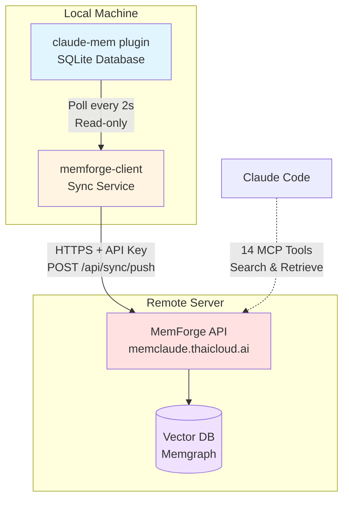

# MemForge Client

[](https://www.gnu.org/licenses/agpl-3.0)

**Persistent semantic memory for Claude** - powered by the MemForge SaaS platform.

MemForge Client is a companion plugin that connects to the [MemForge](https://memclaude.thaicloud.ai) server, providing:

- **14 MCP tools** for semantic search, observation retrieval, and memory snapshots
- **Real-time sync** from local claude-mem database to remote server
- **Hybrid search** combining vector embeddings and full-text search
- **Knowledge graph** with entity lookup and triplet queries

## Installation

### Prerequisites

1. **Bun runtime** - Install from https://bun.sh:
   ```bash
   curl -fsSL https://bun.sh/install | bash
   ```

2. **claude-mem plugin** - Install the base plugin first:
   ```
   /plugin marketplace add thedotmack/claude-mem
   ```

### Option 1: Claude Code CLI (Recommended)

```bash
# Step 1: Add the marketplace
claude plugin marketplace add pitimon/c-memforge

# Step 2: Install the plugin
claude plugin install memforge-client@pitimon-c-memforge

# Step 3: Configure API key
cd ~/.claude/plugins/marketplaces/pitimon-c-memforge
bun run setup "your-api-key"
```

Get your API key at: https://memclaude.thaicloud.ai/settings

### Option 2: Inside Claude Code

```
/plugin marketplace add pitimon/c-memforge
```

Then configure in terminal:

```bash
cd ~/.claude/plugins/marketplaces/pitimon-c-memforge
bun install
bun run setup "your-api-key"
```

### Option 3: Manual Installation

```bash
git clone https://github.com/pitimon/c-memforge.git
cd c-memforge
bun install
bun run setup
```

Then add to Claude Code:
```
/plugin add /path/to/c-memforge
```

### Start Sync Service (Optional)

To sync your local observations to the remote server:

```bash
cd ~/.claude/plugins/marketplaces/pitimon-c-memforge
bun run sync
```

The sync service:
- Polls local database every 2 seconds
- Syncs new observations to remote server
- Retries failed syncs automatically
- Runs in read-only mode (no conflicts with claude-mem)

---

## MCP Tools

### Search Tools

| Tool | Description | Recommendation |
|------|-------------|----------------|
| `mem_search` | Full-text search with filters | ⭐ Most reliable |
| `mem_hybrid_search` | Hybrid search with RRF ranking | Use `vector_weight=0.2` |
| `mem_semantic_search` | Hybrid with mode selection | Flexible |
| `mem_vector_search` | Pure vector/embedding search | Use with caution |

### Observation Tools

| Tool | Description |
|------|-------------|
| `mem_semantic_get` | Get observation by ID |
| `mem_semantic_recent` | Get recent observations |
| `mem_timeline` | Get context around an observation |
| `mem_get_observations` | Batch fetch observations by IDs |

### Entity Tools

| Tool | Description |
|------|-------------|
| `mem_entity_lookup` | Find triplets by entity name |
| `mem_triplets_query` | Query SPO triplets with filters |

### Snapshot Tools

| Tool | Description |
|------|-------------|
| `mem_snapshot_create` | Create memory snapshot |
| `mem_snapshot_list` | List all snapshots |
| `mem_snapshot_restore` | Restore from snapshot |
| `mem_snapshot_delete` | Delete a snapshot |

---

## Configuration

Configuration is stored in `config.local.json` (gitignored):

```json
{
  "apiKey": "your-api-key",
  "serverUrl": "https://memclaude.thaicloud.ai",
  "syncEnabled": true,
  "pollInterval": 2000
}
```

### Options

| Option | Description | Default |
|--------|-------------|---------|
| `apiKey` | Your MemForge API key | (required) |
| `serverUrl` | MemForge server URL | `https://memclaude.thaicloud.ai` |
| `syncEnabled` | Enable real-time sync | `true` |
| `pollInterval` | Sync poll interval in ms | `2000` |

### Self-Hosted Server

To use your own MemForge server:

```json
{
  "apiKey": "your-api-key",
  "serverUrl": "https://your-server.com"
}
```

---

## Architecture



**Components:**
- **claude-mem plugin**: Local SQLite database storing observations
- **memforge-client**: Sync service that polls local DB every 2s and pushes to remote
- **MemForge API**: Remote server handling sync and search requests
- **Vector DB**: Memgraph database with semantic search capabilities

---

## Scripts

| Script | Description |
|--------|-------------|
| `bun run setup [api-key]` | Configure API key (interactive or quick) |
| `bun run sync` | Start database watcher |
| `bun run check` | Check dependencies |
| `bun run mcp` | Run MCP server directly |

---

## Troubleshooting

### "Remote search not configured"

Run `bun run setup` to configure your API key.

### "Required: thedotmack/claude-mem plugin"

Install the base plugin first:
```
/plugin marketplace add thedotmack/claude-mem
```

### "bun: command not found"

Install Bun runtime:
```bash
curl -fsSL https://bun.sh/install | bash
source ~/.bashrc  # or restart terminal
```

### Sync not working

1. Check if sync is enabled: `cat config.local.json`
2. Verify API key is correct
3. Check server connectivity: `curl https://memclaude.thaicloud.ai/health`
4. Check sync logs when running `bun run sync`

### Database locked

The sync service uses read-only mode and should not conflict with claude-mem. If issues persist, restart the sync service.

---

## Updating

### Claude Code

```bash
claude plugin marketplace update pitimon-c-memforge
```

Or inside Claude Code:
```
/plugin marketplace update pitimon-c-memforge
```

---

## Development

See [MAINTENANCE.md](MAINTENANCE.md) for detailed maintenance instructions.

```bash
# Check dependencies
bun run check

# Run MCP server
bun run mcp

# Run sync watcher
bun run sync
```

---

## License

AGPL-3.0 - See [LICENSE](LICENSE) for details.

## Credits

- **MemForge Server** by [@pitimon](https://github.com/pitimon)
- **Claude-Mem Plugin** by [@thedotmack](https://github.com/thedotmack)
