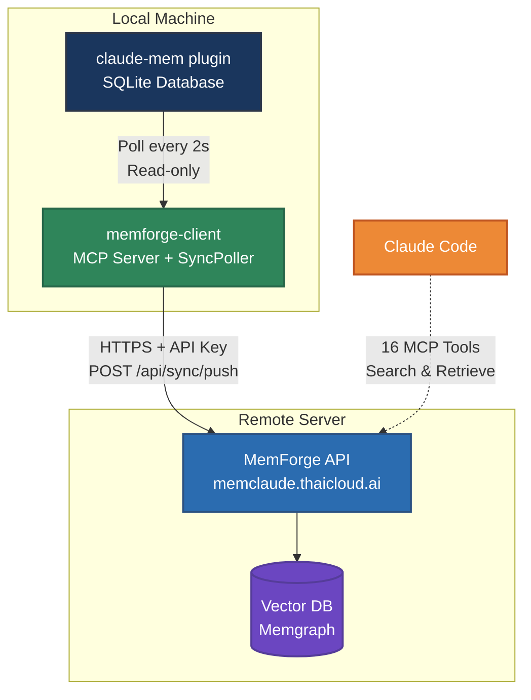
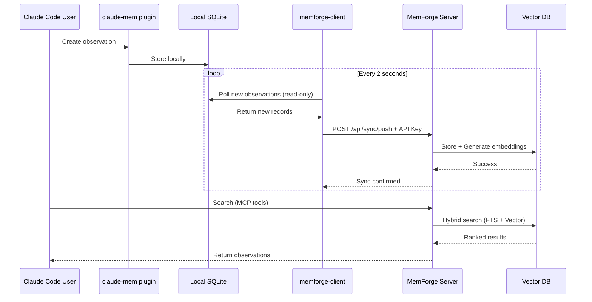

# MemForge Client

[](https://www.gnu.org/licenses/agpl-3.0)

**Persistent semantic memory for Claude** - powered by the MemForge SaaS platform.

MemForge Client is a companion plugin that connects to the [MemForge](https://memclaude.thaicloud.ai) server, providing:

- **16 MCP tools** for semantic search, cross-project knowledge, team collaboration, and diagnostics
- **In-process sync** from local claude-mem database to remote server (no separate daemon)
- **Hybrid search** combining vector embeddings and full-text search
- **Knowledge graph** with entity lookup and triplet queries

## Installation

### Prerequisites

1. **Bun runtime** - Install from https://bun.sh:

   ```bash
   curl -fsSL https://bun.sh/install | bash
   ```

2. **claude-mem plugin** - Install the base plugin first:
   ```
   /plugin marketplace add thedotmack/claude-mem
   ```

### Step 1: Install Plugin

Inside Claude Code:

```
/plugin marketplace add https://github.com/pitimon/c-memforge.git
```

Or via CLI:

```bash
claude plugin marketplace add https://github.com/pitimon/c-memforge.git
claude plugin install memforge-client@pitimon-c-memforge
```

### Step 2: Configure API Key

Get your API key at: https://memclaude.thaicloud.ai/settings

Create the config file:

```bash
mkdir -p ~/.memforge
cat > ~/.memforge/config.json << 'EOF'
{
  "apiKey": "your-api-key-here",
  "serverUrl": "https://memclaude.thaicloud.ai",
  "syncEnabled": true,
  "pollInterval": 2000,
  "role": "client"
}
EOF
```

Replace `your-api-key-here` with your actual API key.

### Step 3: Restart Claude Code

Restart Claude Code to load the plugin. The MCP server starts automatically with sync enabled.

### Verify Installation

Use the `mem_status` tool inside Claude Code to check:

- Config loaded
- Server connectivity
- API key valid
- Sync running

### Alternative: Manual Installation (for development)

```bash
git clone https://github.com/pitimon/c-memforge.git
cd c-memforge
bun install
bun run setup "your-api-key"
```

Then add to Claude Code:

```
/plugin add /path/to/c-memforge
```

### Upgrading from v1.x

If upgrading from v1.x, run `bun run setup` to clean up the legacy sync daemon:

```bash
cd <plugin-directory>
bun run setup "your-api-key"
```

This kills any running `db-watcher` daemon, removes legacy state files (PID, log, watermark, queue), and removes the SessionStart hook from `~/.claude/settings.json`.

Or manually kill the old daemon:

```bash
ps aux | grep db-watcher | grep -v grep | awk '{print $2}' | xargs kill 2>/dev/null
```

### Sync (Automatic)

Sync runs automatically inside the MCP server process when `syncEnabled: true` in config. No separate daemon, hooks, or background processes needed.

The sync poller:

- Polls local claude-mem database every 2 seconds (configurable)
- Syncs new observations and summaries to remote server
- Retries failed syncs automatically (in-memory queue)
- Runs in read-only mode (no conflicts with claude-mem)
- Starts/stops with the MCP server lifecycle

---

## MCP Tools

### Diagnostic Tools

| Tool         | Description                                            |
| ------------ | ------------------------------------------------------ |
| `mem_status` | Check config, connectivity, auth validity, and latency |

### Search Tools

| Tool                  | Description                    | Recommendation          |
| --------------------- | ------------------------------ | ----------------------- |
| `mem_search`          | Full-text search with filters  | Fast (1-3s)             |
| `mem_hybrid_search`   | Hybrid search with RRF ranking | Use `vector_weight=0.2` |
| `mem_semantic_search` | Hybrid with mode selection     | Flexible                |
| `mem_vector_search`   | Pure vector/embedding search   | Slowest (10-38s)        |

All search tools support `offset` parameter for pagination.

### Observation Tools

| Tool                   | Description                       |
| ---------------------- | --------------------------------- |
| `mem_semantic_get`     | Get observation by ID             |
| `mem_semantic_recent`  | Get recent observations           |
| `mem_timeline`         | Get context around an observation |
| `mem_get_observations` | Batch fetch observations by IDs   |

### Entity Tools

| Tool                 | Description                     |
| -------------------- | ------------------------------- |
| `mem_entity_lookup`  | Find triplets by entity name    |
| `mem_triplets_query` | Query SPO triplets with filters |

### Context & Knowledge Tools

| Tool                 | Description                                               |
| -------------------- | --------------------------------------------------------- |
| `mem_cross_project`  | Find observations from other projects via concept overlap |
| `mem_team_knowledge` | Search team knowledge pool (shared by team members)       |
| `mem_stable_context` | Get stable observation log for prompt caching             |

### Data Tools

| Tool                   | Description                         |
| ---------------------- | ----------------------------------- |
| `mem_ingest`           | Ingest observations into the server |
| `mem_workflow_suggest` | Suggest workflows based on context  |

---

## Configuration

Configuration is stored in `~/.memforge/config.json`:

```json
{
  "apiKey": "your-api-key",
  "serverUrl": "https://memclaude.thaicloud.ai",
  "syncEnabled": true,
  "pollInterval": 2000,
  "role": "client"
}
```

### Options

| Option         | Description                        | Default                          |
| -------------- | ---------------------------------- | -------------------------------- |
| `apiKey`       | Your MemForge API key              | (required)                       |
| `serverUrl`    | MemForge server URL                | `https://memclaude.thaicloud.ai` |
| `syncEnabled`  | Enable real-time sync              | `true`                           |
| `pollInterval` | Sync poll interval in ms           | `2000`                           |
| `role`         | Access level (`client` or `admin`) | `client`                         |

### Self-Hosted Server

To use your own MemForge server:

```json
{
  "apiKey": "your-api-key",
  "serverUrl": "https://your-server.com"
}
```

---

## Search Performance Tips

Search latency varies by mode. Choose the right mode for your needs:

| Mode              | Typical Latency | Best For                     |
| ----------------- | --------------- | ---------------------------- |
| `fts` (full-text) | 1-3s            | Keyword search, fastest      |
| `hybrid`          | 5-15s           | Balanced relevance           |
| `vector`          | 10-38s          | Semantic similarity, slowest |

**Tips for faster searches:**

- Use `mode: "fts"` in `mem_semantic_search` for fast keyword search
- Add `dateStart`/`dateEnd` filters to narrow results
- Use lower `limit` values (5-10 instead of 50)
- Add `tz` parameter to avoid timezone mismatches in date filters

---

## Architecture

### High-Level Overview


```mermaid
graph TB
    subgraph "Local Machine"
        CM[claude-mem plugin<br/>SQLite Database]
        MFC[memforge-client<br/>MCP Server + SyncPoller]
    end

    subgraph "Remote Server"
        API[MemForge API<br/>memclaude.thaicloud.ai]
        VDB[(Vector DB<br/>Memgraph)]
    end

    CM -->|Poll every 2s<br/>Read-only| MFC
    MFC -->|HTTPS + API Key<br/>POST /api/sync/push| API
    API --> VDB

    User[Claude Code] -.->|16 MCP Tools<br/>Search & Retrieve| API

    style CM fill:#1a365d,stroke:#2d3748,stroke-width:2px,color:#fff
    style MFC fill:#2f855a,stroke:#276749,stroke-width:2px,color:#fff
    style API fill:#2b6cb0,stroke:#2c5282,stroke-width:2px,color:#fff
    style VDB fill:#6b46c1,stroke:#553c9a,stroke-width:2px,color:#fff
    style User fill:#ed8936,stroke:#c05621,stroke-width:2px,color:#fff
```

**Components:**

- **claude-mem plugin**: Local SQLite database storing observations
- **memforge-client**: MCP server with in-process sync poller that polls local DB every 2s and pushes to remote
- **MemForge API**: Remote server handling sync and search requests
- **Vector DB**: Memgraph database with semantic search capabilities

### Detailed Flow


```mermaid
sequenceDiagram
    participant User as Claude Code User
    participant CM as claude-mem plugin
    participant DB as Local SQLite
    participant MFC as memforge-client
    participant API as MemForge Server
    participant VDB as Vector DB

    User->>CM: Create observation
    CM->>DB: Store locally

    loop Every 2 seconds
        MFC->>DB: Poll new observations (read-only)
        DB-->>MFC: Return new records
        MFC->>API: POST /api/sync/push + API Key
        API->>VDB: Store + Generate embeddings
        VDB-->>API: Success
        API-->>MFC: Sync confirmed
    end

    User->>API: Search (MCP tools)
    API->>VDB: Hybrid search (FTS + Vector)
    VDB-->>API: Ranked results
    API-->>User: Return observations
```

---

## Scripts

| Script                    | Description                              |
| ------------------------- | ---------------------------------------- |
| `bun run setup [api-key]` | Configure API key (interactive or quick) |
| `bun run check`           | Check dependencies                       |
| `bun run mcp`             | Run MCP server directly                  |

---

## Troubleshooting

### "Remote search not configured"

Check that `~/.memforge/config.json` exists with a valid `apiKey`. See [Configuration](#configuration) for the file format. Use `mem_status` tool to diagnose.

### "Required: thedotmack/claude-mem plugin"

Install the base plugin first:

```
/plugin marketplace add thedotmack/claude-mem
```

### "bun: command not found"

Install Bun runtime:

```bash
curl -fsSL https://bun.sh/install | bash
source ~/.bashrc  # or restart terminal
```

### Installation fails with SSH error

If `claude plugin marketplace add pitimon/c-memforge` fails with an SSH error, use the HTTPS URL instead:

```bash
claude plugin marketplace add https://github.com/pitimon/c-memforge.git
```

Or configure git to use HTTPS for all GitHub operations:

```bash
git config --global url."https://github.com/".insteadOf git@github.com:
```

This is a known Claude Code issue ([#9719](https://github.com/anthropics/claude-code/issues/9719)).

### Sync not working

1. Check config: `cat ~/.memforge/config.json`
2. Verify API key is correct
3. Check server connectivity: `curl https://memclaude.thaicloud.ai/health`
4. Check MCP server stderr for `[SyncPoller]` log messages
5. Use `mem_status` tool for diagnostics

### Database locked

The sync poller uses read-only mode and should not conflict with claude-mem. If issues persist, restart Claude Code (which restarts the MCP server and sync poller).

---

## Updating

Inside Claude Code:

```
/plugin marketplace update pitimon-c-memforge
```

Or via CLI:

```bash
claude plugin marketplace update pitimon-c-memforge
claude plugin install memforge-client@pitimon-c-memforge
```

Your config at `~/.memforge/config.json` is preserved across updates. Restart Claude Code after updating.

---

## Development

See [MAINTENANCE.md](MAINTENANCE.md) for detailed maintenance instructions.

```bash
# Check dependencies
bun run check

# Run MCP server (includes sync poller)
bun run mcp
```

---

## License

AGPL-3.0 - See [LICENSE](LICENSE) for details.

## Credits

- **MemForge Server** by [@pitimon](https://github.com/pitimon)
- **Claude-Mem Plugin** by [@thedotmack](https://github.com/thedotmack)
